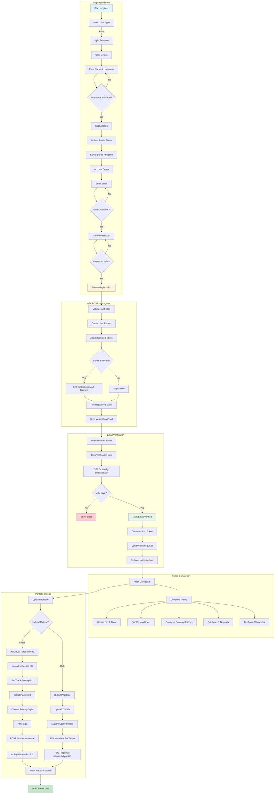

# Artist Signup and Onboarding Flow

This document describes the complete artist registration and onboarding process for InkedIn.

## Flow Diagram

## Step-by-Step Breakdown

### 1. Registration Flow

| Step | Component | Endpoint | Description |
|------|-----------|----------|-------------|
| User Type | `UserTypeSelection.tsx` | - | Select "Artist" |
| Styles | `StylesSelection.tsx` | `GET /api/styles` | Choose specialties |
| Details | `UserDetails.tsx` | `POST /api/check-availability` | Name, username, location |
| Studio | `StudioAutocomplete` | `POST /api/studios/lookup-or-create` | Optional studio affiliation |
| Account | `AccountSetup.tsx` | `POST /api/check-availability` | Email & password |
| Submit | - | `POST /api/register` | Create account |

### 2. Email Verification

| Step | Endpoint | Description |
|------|----------|-------------|
| Send Email | Automatic | Triggered by `Registered` event |
| Verify | `GET /api/verify-email/{id}/{hash}` | Validates signed URL |
| Resend | `POST /api/email/verification-notification` | Rate limited: 6/min |

### 3. Profile Completion

| Section | Endpoint | Description |
|---------|----------|-------------|
| Photo | `POST /api/users/profile-photo` | S3 presigned upload |
| Bio | `PUT /api/users/{id}` | Update about text |
| Styles | `PUT /api/users/{id}` | Sync style relationships |
| Hours | `POST /api/artists/{id}/working-hours` | Set availability |
| Settings | `PUT /api/artists/{id}/settings` | Booking preferences, rates |

### 4. Portfolio Upload

#### Individual Upload
1. Upload images via S3 presigned URLs
2. Set metadata (title, description, placement)
3. Select primary style + additional styles
4. Add tags manually
5. `POST /api/tattoos/create`
6. `GenerateAiTagsJob` dispatched for async AI tag generation
7. `IndexTattooJob` dispatched for async Elasticsearch indexing (tattoo + artist re-index)
8. Frontend shows "Tattoo published! It will appear in search shortly."

#### Bulk Upload
1. Upload ZIP file
2. System extracts and scans images
3. Edit metadata for each tattoo
4. `POST /api/bulk-uploads/{id}/publish`
5. `PublishBulkUploadItems` job creates all tattoos, then batch indexes to Elasticsearch
6. Falls back to individual `IndexTattooJob` dispatches if batch indexing fails
7. Frontend shows "Your tattoos are being processed and will appear in search shortly."

## Password Requirements

- Minimum 8 characters
- At least 1 uppercase letter
- At least 1 lowercase letter
- At least 1 number
- At least 1 symbol (!@#$%^&*...)

## Username Requirements

- Maximum 30 characters
- Only alphanumeric, periods, underscores
- Must be unique

## Key Files

| Component | Path |
|-----------|------|
| Registration Page | `inked-in-www/nextjs/pages/register.tsx` |
| Onboarding Wizard | `inked-in-www/nextjs/components/Onboarding/OnboardingWizard.tsx` |
| Auth Controller | `ink-api/app/Http/Controllers/AuthController.php` |
| Verify Email | `ink-api/app/Http/Controllers/Auth/VerifyEmailController.php` |
| Artist Controller | `ink-api/app/Http/Controllers/ArtistController.php` |
| Tattoo Controller | `ink-api/app/Http/Controllers/TattooController.php` |
| Profile Page | `inked-in-www/nextjs/pages/profile.tsx` |
| Tattoo Upload | `inked-in-www/nextjs/pages/tattoos/update.tsx` |
| Bulk Upload | `inked-in-www/nextjs/pages/bulk-upload/index.tsx` |
