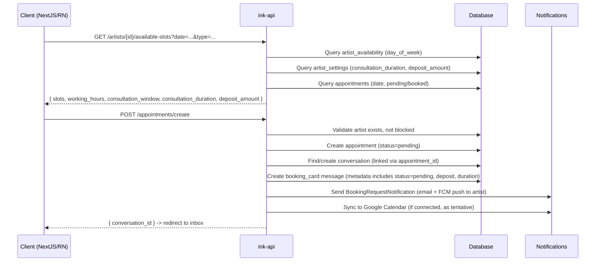
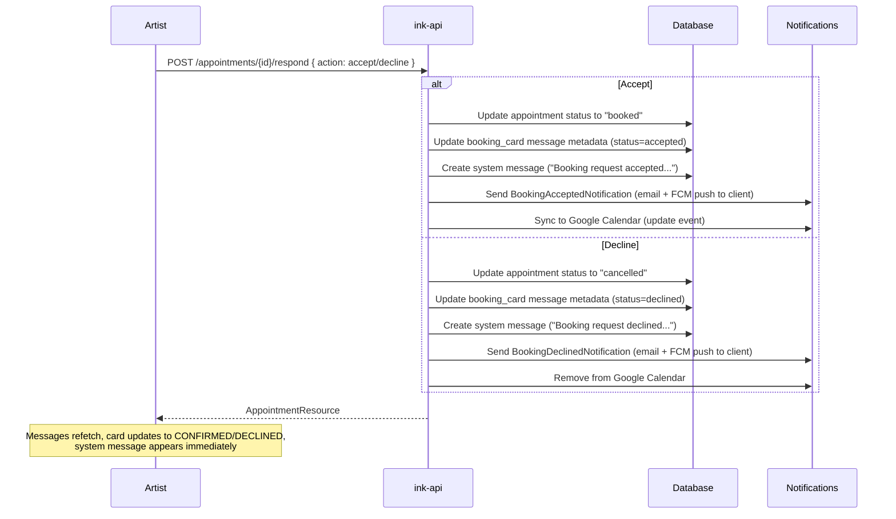

# Booking Flow

## Overview

The booking flow allows clients to request consultations or appointments with artists. The flow spans three platforms (React Native, NextJS, Laravel API) and involves calendar availability, real-time messaging, push notifications, and Google Calendar sync.

## Client Booking Request

### Step 1: Select Date and Booking Type

The client navigates to the artist's calendar and taps an available date.

- **CalendarDayModal** opens as a bottom sheet showing the selected date
- If the artist accepts both consultations and appointments, a **toggle** lets the client choose
- If the artist only accepts one type, an info message is shown: "This artist only accepts consultations/appointments"
- Deposit amount is displayed when appointment type is selected
- Client taps "Request Booking" / "Request Consultation" to proceed

### Step 2: Select Time Slot

**BookingFormModal** opens as a centered modal (keyboard-aware) with the pre-selected booking type.

- Available time slots are fetched from the API based on date and booking type
- Deposit info banner is shown for appointments
- Client selects a time slot, optionally adds notes, and submits

### Step 3: API Creates Appointment

### Step 4: Client Redirected to Inbox

After successful creation, the client is redirected to the conversation with the artist. The **booking_card** message displays:
- "Booking Request" header with **PENDING** badge
- Date, time, duration, deposit details
- The client's notes as italic text below

## Available Slots Logic

## Artist Response Flow

The artist sees each booking request as a **booking_card** in their inbox conversation. Pending cards include **Accept** and **Decline** buttons directly on the card (no separate banner).

## Booking Card Message

The `booking_card` message type is stored in the `messages` table with:

| Field | Description |
|-------|-------------|
| `type` | `'booking_card'` |
| `appointment_id` | Links to the appointment record |
| `metadata.appointment_id` | Appointment ID (for frontend reference) |
| `metadata.type` | `'tattoo'` or `'consultation'` |
| `metadata.status` | `'pending'` -> `'accepted'` or `'declined'` |
| `metadata.date` | Formatted date string |
| `metadata.time` | Formatted time range |
| `metadata.duration` | Duration string |
| `metadata.deposit` | Formatted deposit amount (e.g., "$666") or null |
| `content` | Client's message/notes |

The `status` field in metadata is updated by the `respondToRequest` endpoint when the artist accepts or declines. The frontend renders different states:

- **pending**: Shows PENDING badge + Accept/Decline buttons (artist view only)
- **accepted**: Shows CONFIRMED badge, no action buttons
- **declined**: Shows DECLINED badge, no action buttons

## Notifications

| Event | Recipient | Notification Class | Channels |
|-------|-----------|-------------------|----------|
| Booking created | Artist | `BookingRequestNotification` | Email, FCM Push |
| Booking accepted | Client | `BookingAcceptedNotification` | Email, FCM Push |
| Booking declined | Client | `BookingDeclinedNotification` | Email, FCM Push |

Push notifications are gated by:
1. User has device tokens registered (`device_tokens` table)
2. User has not disabled the notification type (`notification_preferences` table, `channel=push`)

Email notifications are gated by `email_unsubscribed` flag on the user.

## Consultation Window Configuration

Artists configure consultation windows per day in the Working Hours Editor:
- Each day can have an optional consultation window (start/end time within working hours)
- When set, consultations are only bookable within the window
- Appointments are only bookable outside the window
- When not set, both types can be booked during any working hours
- Consultation duration (15/30/45/60 min) is set in artist settings

## Artist Settings (Booking-Related)

| Setting | Description | Default |
|---------|-------------|---------|
| `books_open` | Whether artist is accepting bookings | `true` |
| `accepts_consultations` | Whether artist accepts consultation requests | `false` |
| `accepts_appointments` | Whether artist accepts appointment requests | `false` |
| `deposit_amount` | Required deposit amount for appointments | `null` |
| `consultation_duration` | Duration of consultations in minutes | `15` |

## Key Files

| Component | Path |
|-----------|------|
| Appointment Controller | `ink-api/app/Http/Controllers/AppointmentController.php` |
| Appointment Model | `ink-api/app/Models/Appointment.php` |
| Booking Request Notification | `ink-api/app/Notifications/BookingRequestNotification.php` |
| Booking Accepted Notification | `ink-api/app/Notifications/BookingAcceptedNotification.php` |
| Booking Declined Notification | `ink-api/app/Notifications/BookingDeclinedNotification.php` |
| Push Preferences Trait | `ink-api/app/Notifications/Traits/RespectsPushPreferences.php` |
| Shared Appointment Service | `inked-in-www/shared/services/appointmentService.ts` |
| RN CalendarDayModal | `inked-in-www/reactnative/app/components/Calendar/CalendarDayModal.tsx` |
| RN BookingFormModal | `inked-in-www/reactnative/app/components/Calendar/BookingFormModal.tsx` |
| RN MessageBubble | `inked-in-www/reactnative/app/components/inbox/MessageBubble.tsx` |
| NextJS BookingModal | `inked-in-www/nextjs/components/BookingModal.tsx` |
| NextJS MessageBubble | `inked-in-www/nextjs/components/inbox/MessageBubble.tsx` |
