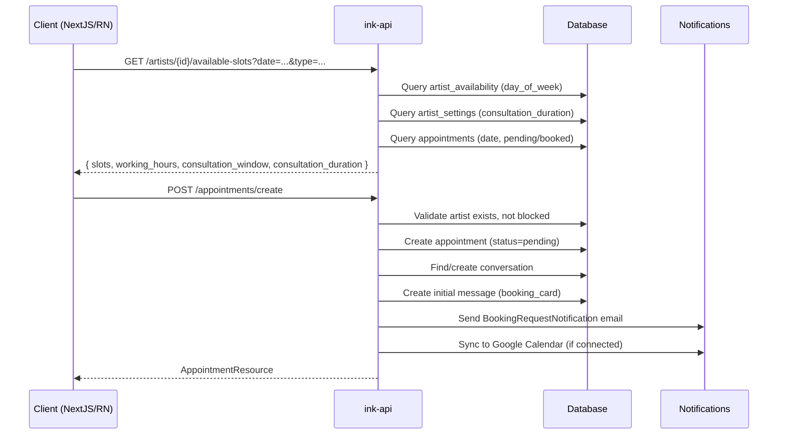
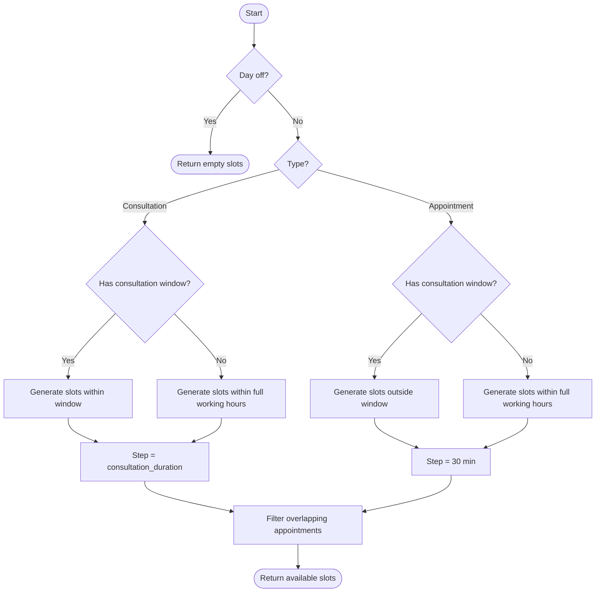
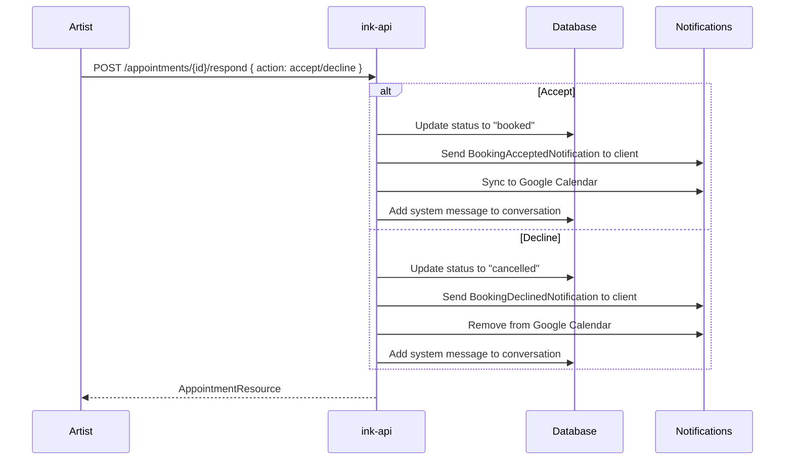

# Booking Flow

## Client Booking Request

## Available Slots Logic

## Artist Respond to Request

## Consultation Window Configuration

Artists configure consultation windows per day in the Working Hours Editor:
- Each day can have an optional consultation window (start/end time within working hours)
- When set, consultations are only bookable within the window
- Appointments are only bookable outside the window
- When not set, both types can be booked during any working hours
- Consultation duration (15/30/45/60 min) is set in artist settings
