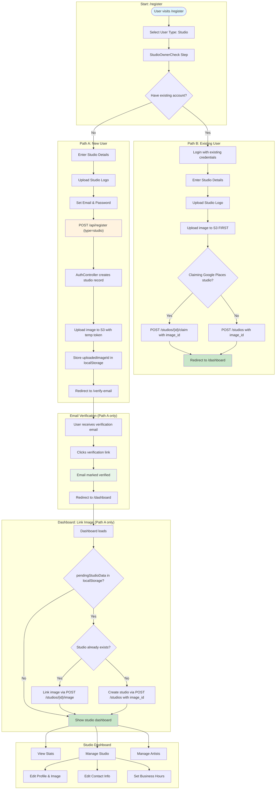
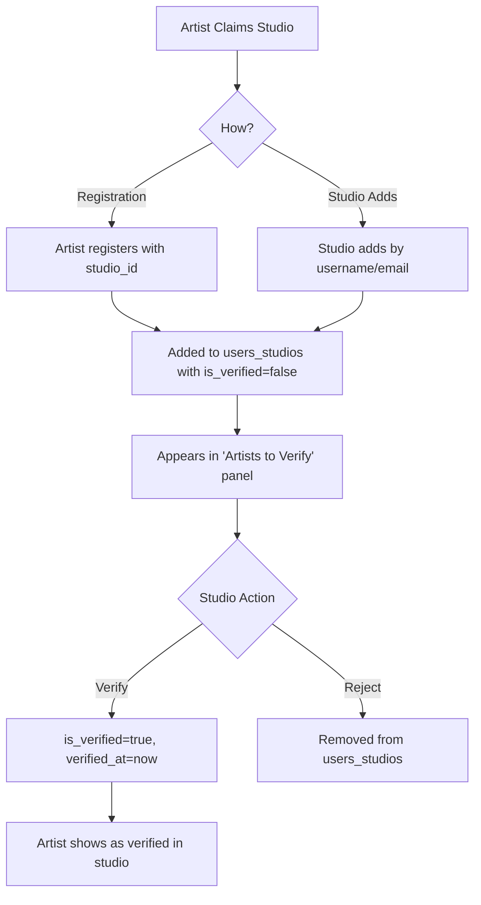

# Studio Registration and Management Flow

This document describes the complete studio registration, dashboard, and profile management process for InkedIn.

## User Types

Studios use `type_id = 3` in the users table. This distinguishes them from:
- Clients (`type_id = 1`)
- Artists (`type_id = 2`)

The studio itself lives in the `studios` table (separate from `users`). A user "owns" a studio via `studios.owner_id`.

## Registration Paths Overview

There are two distinct registration paths for studios, with different image handling:

| Path | Who | Auth Required? | Studio Created By | Image Linked By |
|------|-----|----------------|-------------------|-----------------|
| **A: New User** | First-time user | No (creates account) | `AuthController::register()` | `dashboard.tsx` pending data effect |
| **B: Existing User** | Already has account | Yes (logged in) | `StudioController::create()` or `claim()` | Included in create/claim payload (`image_id`) |

## Flow Diagram



## Path A: New User Registration (Detailed)

This is the most complex path because the user doesn't have an auth token yet.

### Step 1: Registration Form
The user fills out studio details and account credentials in the onboarding wizard.

| Step | Component | Endpoint | Description |
|------|-----------|----------|-------------|
| User Type | `UserTypeStep` | - | Select "Studio" |
| Owner Check | `StudioOwnerCheckStep` | - | Select "No, create new account" |
| Studio Details | `StudioDetailsStep` | `POST /studios/check-availability` | Name, username, location, logo |
| Account | `StudioDetailsStep` | `POST /check-availability` | Email & password (embedded in same step) |

### Step 2: Submit Registration

Frontend: `register.tsx` sends `POST /api/register` with `type: 'studio'`.

**What `AuthController::register()` does (lines 112-138):**
1. Creates the `users` record with `type_id = 3`
2. If `claim_studio_id` is provided: claims the existing studio (`is_claimed = true`, sets `owner_id`)
3. Otherwise: creates a new `studios` record with `owner_id = user.id`
4. Returns a temporary `registration-upload` token (30-min expiry)
5. Returns `studio.id` in the response

The studio record exists at this point but has **no image** yet.

### Step 3: Upload Image

After receiving the temp token, `register.tsx`:
1. Sets the token via `setToken(result.token)`
2. Uploads the studio logo to S3 via `imageService.upload(file, 'studio')`
3. Gets back an `Image` record with an `id`

### Step 4: Store Pending Data

`register.tsx` stores the `uploadedImageId` in localStorage:

```javascript
localStorage.setItem('pendingStudioData', JSON.stringify({
  name, username, bio, location, locationLatLong,
  email, phone, existingStudioId,
  uploadedImageId,  // The key field - links image to studio later
}));
```

Then redirects to `/verify-email`.

### Step 5: Email Verification

User clicks the verification link. `VerifyEmailController` marks the email as verified, upgrades the temp token to permanent, and redirects to `/dashboard`.

### Step 6: Dashboard Links the Image

`dashboard.tsx` has a `useEffect` that runs on mount for studio accounts:

```
processPendingStudioData():
  1. Check if pendingStudioData exists in localStorage
  2. Remove it immediately (prevent duplicate processing)
  3. If ownedStudio already exists (normal case):
     -> Call studioService.uploadImage(studioId, uploadedImageId)
     -> This sets studios.image_id via StudioService::setStudioImage()
  4. If ownedStudio doesn't exist (edge case):
     -> Call studioService.create() or claim() with image_id in payload
  5. refreshUser() to update UI
```

### React Native Equivalent

`RegisterScreen.tsx` follows the same flow but:
- Uses `uploadImagesToS3()` instead of `imageService.upload()`
- After registration, calls `studioService.update(studioId, { image_id: imageId })` directly instead of storing pending data (RN doesn't redirect to a verify page — `VerifyEmailGate` polls in-app)

## Path B: Existing User Creating Studio (Detailed)

This is the simpler path. The user is already authenticated.

### Step 1: Login

The `StudioOwnerCheckStep` lets the user login with existing credentials. After login, `isAuthenticated` is true and `existingAccountId` is set.

### Step 2: Studio Details

Same `StudioDetailsStep` form, but email/password fields are hidden (already authenticated).

### Step 3: Submit (Atomic Create with Image)

`register.tsx` (and `RegisterScreen.tsx` on RN) does everything in one flow:

1. **Upload image first** via `imageService.upload(file, 'studio')` (or `uploadImagesToS3` on RN)
2. **Build payload** with all studio fields + `image_id`
3. **Create or claim**:
   - If claiming an existing Google Places studio: `POST /studios/{id}/claim` with `image_id`
   - Otherwise: `POST /studios` with `image_id`
4. `refreshUser()` and redirect to `/dashboard`

No pending data. No dashboard processing. Image is linked atomically.

### API Handling

**`StudioController::create()`** accepts `image_id` in the payload and sets it directly on the new studio record.

**`StudioController::claim()`** validates `image_id` (nullable, must exist in images table) and sets it during the claim update.

## Studio Image: How `image_id` Gets Set

There are exactly three code paths that set `studios.image_id`:

| Path | When | Method |
|------|------|--------|
| `StudioController::create()` | New studio creation | `image_id` in constructor payload |
| `StudioController::claim()` | Claiming existing studio | `image_id` in update data |
| `StudioController::uploadImage()` | Dashboard edit / pending data link | `StudioService::setStudioImage()` |

The `StudioController::update()` method also sets `image_id` since it's in `$fillable`, but this is used for general studio updates, not the registration flow.

## Studio Dashboard

### Dashboard Access by User Type

| User Type | Has Studio | Dashboard View |
|-----------|------------|----------------|
| Studio Account (`type_id=3`) | Always | Direct studio dashboard (no tabs) |
| Artist (`type_id=2`) | Yes (owned) | Two tabs: "My Artist Profile" + "My Studio" |
| Artist (`type_id=2`) | No | Artist dashboard only (no tabs) |
| Client (`type_id=1`) | Yes (owned) | Two tabs: "My Dashboard" + "My Studio" |
| Client (`type_id=1`) | No | Client dashboard only |

### Studio Ownership

Any user type can own a studio via the `owner_id` field on the `studios` table:
- Studio accounts (`type_id=3`) typically own a studio
- Artists can own a studio (e.g., solo artist with their own studio)
- Clients can own a studio (e.g., business owner who isn't an artist)

The `owned_studio` relationship is returned in the user API response when authenticated.

### Dashboard Stats

Endpoint: `GET /api/studios/{id}/dashboard-stats`

| Metric | Source | Description |
|--------|--------|-------------|
| Page Views | `ProfileView` model | Views this week vs last week |
| Bookings | `Appointment` model | Bookings for studio artists |
| Inquiries | `Conversation` model | Messages to studio artists |
| Artists Count | `users_studios` pivot | Artists linked to studio |

### Dashboard Editing

#### 1. Edit Studio Modal (`EditStudioModal.tsx`)
Opens from the settings icon in dashboard header. Used for:
- Studio name
- About/bio description
- Email
- Profile image

Endpoint: `PUT /api/studios/studio/{id}`

#### 2. Contact Information Card (Inline Editing)
Inline editing panel directly on dashboard. Used for:
- Street address
- Address Line 2
- City, State, ZIP
- Phone number

Endpoint: `PUT /api/studios/studio/{id}` (same endpoint, different fields)

#### 3. Business Hours Modal (`WorkingHoursModal.tsx`)
Reuses the same modal component used by artists. Opens from "Edit" button on Business Hours card.

Endpoint: `POST /api/studios/{id}/working-hours`

Request body:
```json
{
  "availability": [
    {
      "day_of_week": 0,
      "start_time": "09:00:00",
      "end_time": "17:00:00",
      "is_day_off": false
    }
  ]
}
```

| Field | Type | Description |
|-------|------|-------------|
| day_of_week | number | Day of week (0=Sunday, 6=Saturday) |
| start_time | string | Open time (HH:MM:SS format) |
| end_time | string | Close time (HH:MM:SS format) |
| is_day_off | boolean | Whether the studio is closed this day |

### Address Management

Studios use the `addresses` table via `address_id` foreign key:

```php
// StudioController::update handles address creation/update
if ($hasAddressData) {
    if ($studio->address_id && $studio->address) {
        $studio->address->update($addressData);
    } else {
        $address = Address::create($addressData);
        $studio->address_id = $address->id;
    }
}
```

## Artist Management

### Artist-Studio Relationship

The `users_studios` pivot table tracks artist affiliations with verification status:

| Column | Type | Description |
|--------|------|-------------|
| user_id | FK | Artist user ID |
| studio_id | FK | Studio ID |
| is_verified | boolean | Whether studio has verified the artist (default: false) |
| verified_at | timestamp | When verification occurred (nullable) |
| initiated_by | string | Who initiated: 'artist' (join request) or 'studio' (invitation) |

### Artist Verification Flow



### Artist Registration with Studio Affiliation

When an artist registers and selects a studio during signup:
1. `studio_id` is saved on the user record
2. Artist is automatically added to `users_studios` pivot with `is_verified = false`
3. Studio owner sees them in the "Artists to Verify" dashboard panel

### Add Artist

Endpoint: `POST /api/studios/{id}/artists`

Accepts username OR email:
```json
{ "username": "artist_username" }
```
```json
{ "email": "artist@email.com" }
```
```json
{ "identifier": "username_or_email" }
```

Artist is added with `is_verified = false` (pending verification).

### Verify Artist

Endpoint: `POST /api/studios/{id}/artists/{userId}/verify`

Marks an artist as verified at the studio. Sets `is_verified = true` and `verified_at = now()`.

### Unverify Artist

Endpoint: `POST /api/studios/{id}/artists/{userId}/unverify`

Reverts artist to pending status. Sets `is_verified = false` and `verified_at = null`.

### Remove Artist

Endpoint: `DELETE /api/studios/{id}/artists/{userId}`

Completely removes artist from studio (removes from `users_studios` pivot).

### Get Artists

Endpoint: `GET /api/studios/{id}/artists`

Returns all studio artists with verification status.

## Studio Public Profile

Route: `/studios/[slug]`

### Verified vs Unclaimed View

| Condition | View | Description |
|-----------|------|-------------|
| `is_verified = true` | Full profile | Complete studio page |
| `is_claimed = true` | Full profile | Owner-claimed studio |
| `owner_id = user.id` | Full profile | Current user is owner |
| None of above | Unclaimed | Shows "Claim This Studio" banner |

### Profile Sections

| Section | Data Source | Description |
|---------|-------------|-------------|
| Header | Studio record | Name, location, rating, about |
| Portfolio | Studio artists' tattoos | Grid of work |
| Artists | `users_studios` pivot | List of studio artists |
| Hours | `studio_availability` table | Weekly schedule |
| Location | `address` relation | Full address with Google Maps link |
| Contact | Studio record | Phone, email, website, social |
| Announcements | `studio_announcements` | Active announcements |

## Key Database Tables

| Table | Description |
|-------|-------------|
| `users` | User accounts (type_id=3 for studios) |
| `studios` | Studio records (has `image_id`, `owner_id`) |
| `images` | Image records (uri points to S3) |
| `addresses` | Physical addresses |
| `studio_availability` | Weekly working hours (studio_id, day_of_week 0-6, start_time, end_time, is_day_off) |
| `users_studios` | Artist-studio relationships with verification (user_id, studio_id, is_verified, verified_at, initiated_by) |
| `studio_announcements` | Studio announcements |
| `profile_views` | Polymorphic view tracking |

## Key API Endpoints

| Method | Endpoint | Description |
|--------|----------|-------------|
| POST | `/api/register` | Create user + studio (type=studio) |
| POST | `/api/studios` | Create new studio (auth required) |
| POST | `/api/studios/{id}/claim` | Claim existing studio (accepts `image_id`) |
| PUT | `/api/studios/studio/{id}` | Update studio details |
| POST | `/api/studios/{id}/image` | Upload/link studio image |
| GET | `/api/studios/{id}` | Get studio by ID or slug |
| GET | `/api/studios/{id}/artists` | Get studio artists with verification status |
| POST | `/api/studios/{id}/artists` | Add artist by username or email |
| DELETE | `/api/studios/{id}/artists/{userId}` | Remove artist from studio |
| POST | `/api/studios/{id}/artists/{userId}/verify` | Verify an artist |
| POST | `/api/studios/{id}/artists/{userId}/unverify` | Unverify an artist |
| GET | `/api/studios/{id}/dashboard-stats` | Get dashboard statistics |
| GET | `/api/studios/{id}/dashboard` | Get all dashboard data in one request |
| POST | `/api/studios/{id}/working-hours` | Set studio working hours |
| POST | `/api/studios/lookup-or-create` | Lookup/create from Google Places |
| POST | `/api/studios/check-availability` | Check username/email availability |

## Key Files

| Component | Path |
|-----------|------|
| Registration Page (Web) | `inked-in-www/nextjs/pages/register.tsx` |
| Registration Screen (RN) | `inked-in-www/reactnative/app/screens/auth/RegisterScreen.tsx` |
| Studio Details Form (Web) | `inked-in-www/nextjs/components/Onboarding/StudioDetails.tsx` |
| Studio Details Form (RN) | `inked-in-www/reactnative/app/components/onboarding/StudioDetailsStep.tsx` |
| Dashboard (Web) | `inked-in-www/nextjs/pages/dashboard.tsx` |
| Edit Studio Modal | `inked-in-www/nextjs/components/EditStudioModal.tsx` |
| Add Artist Modal | `inked-in-www/nextjs/components/AddArtistModal.tsx` |
| Working Hours Modal | `inked-in-www/nextjs/components/WorkingHoursModal.tsx` |
| Studio Profile Page | `inked-in-www/nextjs/pages/studios/[slug].tsx` |
| Studio Service (Web) | `inked-in-www/nextjs/services/studioService.ts` |
| Studio Service (Shared/RN) | `inked-in-www/shared/services/index.ts` |
| Auth Controller | `ink-api/app/Http/Controllers/AuthController.php` |
| Studio Controller | `ink-api/app/Http/Controllers/StudioController.php` |
| Studio Service | `ink-api/app/Services/StudioService.php` |
| Studio Resource | `ink-api/app/Http/Resources/StudioResource.php` |
| Studio Model | `ink-api/app/Models/Studio.php` |
| Verify Email Controller | `ink-api/app/Http/Controllers/Auth/VerifyEmailController.php` |
| Google Places Service | `ink-api/app/Services/GooglePlacesService.php` |
