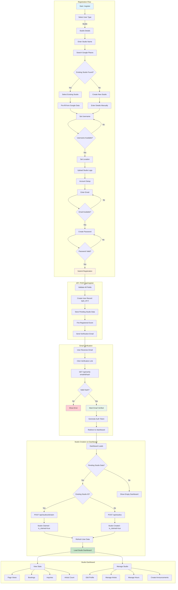

# Studio Registration and Management Flow

This document describes the complete studio registration, dashboard, and profile management process for InkedIn.

## User Types

Studios use `type_id = 3` in the users table. This distinguishes them from:
- Clients (`type_id = 1`)
- Artists (`type_id = 2`)

## Flow Diagram



## Step-by-Step Breakdown

### 1. Registration Flow

| Step | Component | Endpoint | Description |
|------|-----------|----------|-------------|
| User Type | `UserTypeSelection.tsx` | - | Select "Studio" |
| Studio Details | `StudioDetails.tsx` | `POST /api/studios/lookup-or-create` | Search/select Google Places studio |
| Username Check | `StudioDetails.tsx` | `POST /api/studios/check-availability` | Verify username available |
| Account | `AccountSetup.tsx` | `POST /api/check-availability` | Email & password |
| Submit | - | `POST /api/register` | Create user account with type=studio |

### 2. Registration Paths

#### Path A: New Studio (No Google Places Match)
1. User enters studio name
2. No existing Google Places studio found
3. User fills all details manually
4. Creates new studio record with `is_claimed = true`

#### Path B: Claim Existing Google Places Studio
1. User searches studio name
2. Selects existing Google Places studio from autocomplete
3. System calls `POST /api/studios/lookup-or-create` with place_id
4. Studio record created with `is_claimed = false` (if new to database)
5. After email verification, `POST /api/studios/{id}/claim` marks `is_claimed = true`

#### Path C: Existing User Creating Studio
1. Authenticated artist/client wants to add studio
2. Uses same flow but skips email/password
3. Studio created immediately (no email verification needed)

### 3. Email Verification

| Step | Endpoint | Description |
|------|----------|-------------|
| Send Email | Automatic | Triggered by `Registered` event |
| Verify | `GET /api/verify-email/{id}/{hash}` | Validates signed URL |
| Redirect | - | `type_id = 2 OR 3` redirects to `/dashboard` |
| Resend | `POST /api/email/verification-notification` | Rate limited: 6/min |

### 4. Pending Studio Creation

After email verification, the dashboard creates the studio:

```javascript
// Stored in localStorage during registration
pendingStudioData = {
  name: "Studio Name",
  username: "studioname",
  bio: "About text",
  location: "City, State",
  locationLatLong: "lat,lng",
  email: "studio@email.com",
  phone: "555-1234",
  existingStudioId: 123  // Only if claiming existing
}
```

| Condition | Endpoint | Action |
|-----------|----------|--------|
| `existingStudioId` present | `POST /api/studios/{id}/claim` | Claim existing studio |
| No `existingStudioId` | `POST /api/studios` | Create new studio |

## Studio Dashboard

### Dashboard Stats

Endpoint: `GET /api/studios/{id}/dashboard-stats`

| Metric | Source | Description |
|--------|--------|-------------|
| Page Views | `ProfileView` model | Views this week vs last week |
| Bookings | `Appointment` model | Bookings for studio artists |
| Inquiries | `Conversation` model | Messages to studio artists |
| Artists Count | `users_studios` pivot | Artists linked to studio |

### Dashboard Tabs

| Tab | Description | Key Actions |
|-----|-------------|-------------|
| Studio | Studio management | Edit profile, manage artists |
| Messages | Inquiries | View/respond to messages |
| Calendar | Bookings | View artist appointments |

## Studio Profile Management

### Dashboard Editing Components

The studio dashboard provides three ways to edit studio information:

#### 1. Edit Studio Modal (`EditStudioModal.tsx`)
Opens from the settings icon in dashboard header. Used for:
- Studio name
- About/bio description
- Email
- Profile image

Endpoint: `PUT /api/studios/studio/{id}`

#### 2. Contact Information Card (Inline Editing)
Inline editing panel directly on dashboard. Used for:
- Street address
- Address Line 2
- City, State, ZIP
- Phone number

Endpoint: `PUT /api/studios/studio/{id}` (same endpoint, different fields)

#### 3. Business Hours Modal (`WorkingHoursModal.tsx`)
Reuses the same modal component used by artists. Opens from "Edit" button on Business Hours card.

Endpoint: `POST /api/studios/{id}/working-hours`

Request body:
```json
{
  "availability": [
    {
      "day_of_week": 0,
      "start_time": "09:00:00",
      "end_time": "17:00:00",
      "is_day_off": false
    }
  ]
}
```

| Field | Type | Description |
|-------|------|-------------|
| day_of_week | number | Day of week (0=Sunday, 6=Saturday) |
| start_time | string | Open time (HH:MM:SS format) |
| end_time | string | Close time (HH:MM:SS format) |
| is_day_off | boolean | Whether the studio is closed this day |

### Address Management

Studios use the `addresses` table via `address_id` foreign key:

```php
// StudioController::update handles address creation/update
if ($hasAddressData) {
    if ($studio->address_id && $studio->address) {
        $studio->address->update($addressData);
    } else {
        $address = Address::create($addressData);
        $studio->address_id = $address->id;
    }
}
```

### Studio Image

Endpoint: `POST /api/studios/{id}/image`

Supports two flows:
1. **Presigned URL** (faster): Upload to S3 first, then `{ image_id: 123 }`
2. **Direct upload**: Send file as `multipart/form-data`

## Artist Management

### Add Artist

Endpoint: `POST /api/studios/{id}/artists`

```json
{ "username": "artist_username" }
```

### Remove Artist

Endpoint: `DELETE /api/studios/{id}/artists/{userId}`

### Get Artists

Endpoint: `GET /api/studios/{id}/artists`

## Studio Public Profile

Route: `/studios/[slug]`

### Verified vs Unclaimed View

| Condition | View | Description |
|-----------|------|-------------|
| `is_verified = true` | Full profile | Complete studio page |
| `is_claimed = true` | Full profile | Owner-claimed studio |
| `owner_id = user.id` | Full profile | Current user is owner |
| None of above | Unclaimed | Shows "Claim This Studio" banner |

### Profile Sections

| Section | Data Source | Description |
|---------|-------------|-------------|
| Header | Studio record | Name, location, rating, about |
| Portfolio | Studio artists' tattoos | Grid of work |
| Artists | `users_studios` pivot | List of studio artists |
| Hours | `business_hours` relation | Weekly schedule |
| Location | `address` relation | Full address with Google Maps link |
| Contact | Studio record | Phone, email, website, social |
| Announcements | `studio_announcements` | Active announcements |

## Key Database Tables

| Table | Description |
|-------|-------------|
| `users` | User accounts (type_id=3 for studios) |
| `studios` | Studio records |
| `addresses` | Physical addresses |
| `studio_availability` | Weekly working hours (studio_id, day_of_week 0-6, start_time, end_time, is_day_off) |
| `users_studios` | Artist-studio relationships |
| `studio_announcements` | Studio announcements |
| `profile_views` | Polymorphic view tracking |

## Key API Endpoints

| Method | Endpoint | Description |
|--------|----------|-------------|
| POST | `/api/studios` | Create new studio |
| POST | `/api/studios/{id}/claim` | Claim existing studio |
| PUT | `/api/studios/studio/{id}` | Update studio details |
| GET | `/api/studios/{id}/working-hours` | Get studio working hours |
| POST | `/api/studios/{id}/working-hours` | Set studio working hours |
| POST | `/api/studios/{id}/image` | Upload studio image |
| GET | `/api/studios/{id}` | Get studio by ID |
| GET | `/api/studios/{id}/dashboard-stats` | Get dashboard statistics |
| POST | `/api/studios/lookup-or-create` | Lookup/create from Google Places |
| POST | `/api/studios/check-availability` | Check username/email availability |

## Key Files

| Component | Path |
|-----------|------|
| Registration Page | `inked-in-www/nextjs/pages/register.tsx` |
| Studio Details Form | `inked-in-www/nextjs/components/Onboarding/StudioDetails.tsx` |
| Dashboard | `inked-in-www/nextjs/pages/dashboard.tsx` |
| Edit Studio Modal | `inked-in-www/nextjs/components/EditStudioModal.tsx` |
| Working Hours Modal | `inked-in-www/nextjs/components/WorkingHoursModal.tsx` |
| Working Hours Editor | `inked-in-www/nextjs/components/WorkingHoursEditor.tsx` |
| Studio Profile Page | `inked-in-www/nextjs/pages/studios/[slug].tsx` |
| Studio Controller | `ink-api/app/Http/Controllers/StudioController.php` |
| Studio Resource | `ink-api/app/Http/Resources/StudioResource.php` |
| Studio Model | `ink-api/app/Models/Studio.php` |
| Studio Availability Model | `ink-api/app/Models/StudioAvailability.php` |
| Address Model | `ink-api/app/Models/Address.php` |
| Verify Email Controller | `ink-api/app/Http/Controllers/Auth/VerifyEmailController.php` |
| Google Places Service | `ink-api/app/Services/GooglePlacesService.php` |
