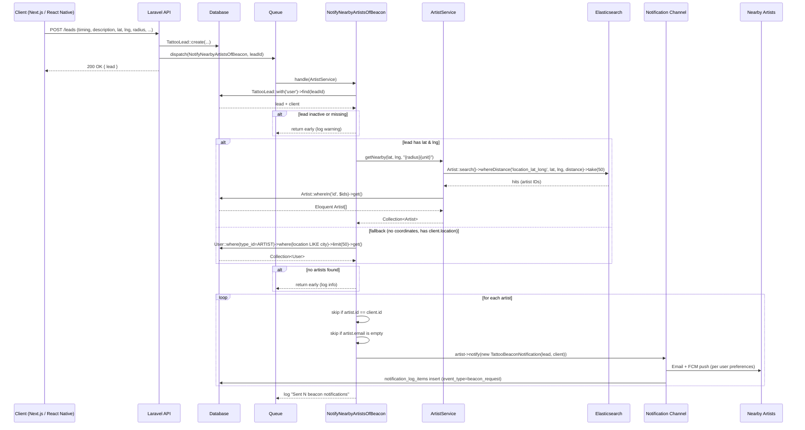

# Tattoo Beacon Notification Flow

## Overview

When a client activates the "Let Artists Find You" beacon (or creates a `seeking` post), the system finds nearby artists and notifies them. Artist matching is geo-distance based using Elasticsearch when the lead has coordinates, with a string-location fallback when it doesn't.

See also: [tattoo-beacon.md](../tattoo-beacon.md) for the API surface, schema, and notification logging.

## Sequence Diagram



## Key Decisions

### Why Elasticsearch instead of MySQL for the geo lookup?

Before today, this job ran a raw SQL query against the `users` table:

```php
->whereRaw("CAST(SUBSTRING_INDEX(location_lat_long, ',', 1) AS DECIMAL(10,7)) BETWEEN ? AND ?", ...)
->whereRaw("CAST(SUBSTRING_INDEX(location_lat_long, ',', -1) AS DECIMAL(10,7)) BETWEEN ? AND ?", ...)
```

That predicate is non-sargable — `CAST()` and `SUBSTRING_INDEX()` on the column force a full table scan on every beacon dispatch, the bounding box is approximate (corners ~40% farther than `radius`), and results are not distance-sorted.

The artist Elasticsearch index already maps `location_lat_long` as a `geo_point` (see `ArtistIndexConfigurator`), and Larelastic provides a `whereDistance` helper used elsewhere in the codebase. Switching to ES gives us a true `geo_distance` query against an indexed field, accurate radius math, and constant-time lookups regardless of artist table size.

### Why rehydrate Eloquent models from ES IDs?

`Artist::search()` returns array hits, but the rest of the job needs `$artist->notify(...)` which requires Eloquent model instances (notifiable). The `Artist::whereIn('id', $ids)->get()` step is one extra database query that brings back full models with relationships available for the notification's `via()` and `toMail()` methods.

### Why keep the string-location fallback?

Some legacy or manually-created leads may not have `lat`/`lng` populated. Rather than failing those, we fall back to the existing `location LIKE city` query against MySQL. This path is rare in practice but preserves backward compatibility.

### Why pass distance as a string (`'50mi'`) instead of separate value + unit?

Larelastic's `whereDistance($field, $lat, $lng, $distance)` accepts the distance with a unit suffix (`'25mi'`, `'80km'`) and passes it directly to Elasticsearch, which natively understands both units. This avoids a manual km→mi conversion and matches the established pattern in `SearchService::buildDistanceParam()`.

## Files

| Layer | File |
|---|---|
| Job | `app/Jobs/NotifyNearbyArtistsOfBeacon.php` |
| Service | `app/Services/ArtistService.php` (`getNearby()`) |
| Model | `app/Models/TattooLead.php` |
| Notification | `app/Notifications/TattooBeaconNotification.php` |
| ES Index Config | `app/Models/ArtistIndexConfigurator.php` (`location_lat_long` → `geo_point`) |
| ES Index Resource | `app/Http/Resources/Elastic/ArtistIndexResource.php` |
| Tests | `tests/Unit/Jobs/NotifyNearbyArtistsOfBeaconTest.php` |
