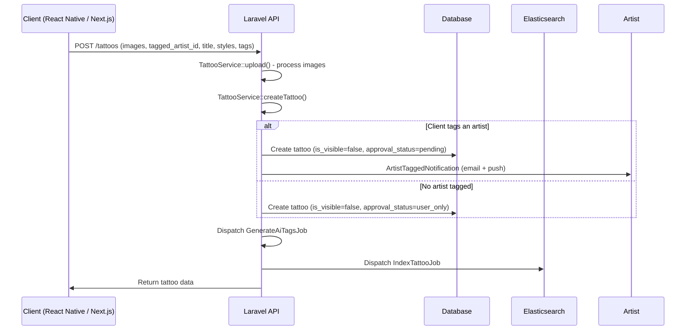
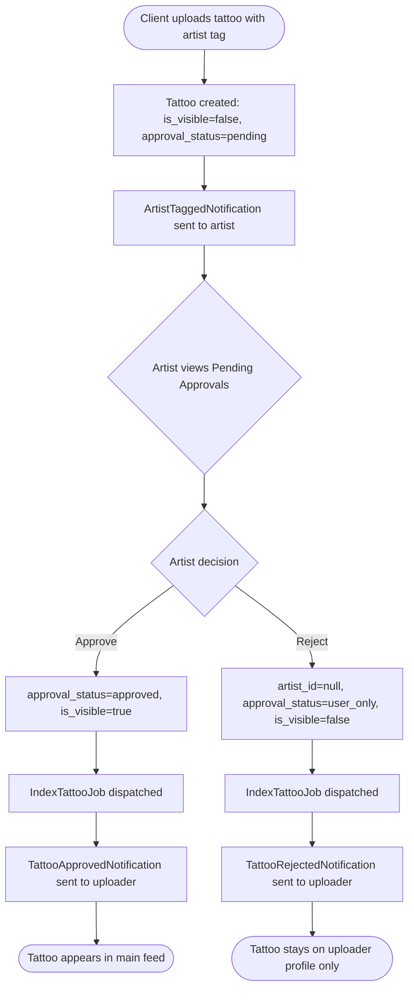

# Tattoo Upload and Tag Approval Flow

## Overview

Users (both clients and artists) can upload tattoos. When a client tags an artist on their upload, the tattoo enters a pending approval workflow. The artist receives notifications and can approve or reject the tag from their Pending Approvals screen. The `is_visible` field controls whether a tattoo appears in the main feed/search, while `approval_status` tracks the workflow state.

## Visibility Rules

| Scenario | `is_visible` | `approval_status` | Appears in Feed | Appears on User Profile |
|---|---|---|---|---|
| Artist uploads own tattoo | `true` | `approved` | Yes | Yes |
| Client uploads, tags artist | `false` | `pending` | No | Yes (with pending badge) |
| Client uploads, no artist tag | `false` | `user_only` | No | Yes |
| Artist approves tag | `true` | `approved` | Yes | Yes |
| Artist rejects tag | `false` | `user_only` | No | Yes |

All tattoos are indexed in Elasticsearch regardless of `is_visible`. Search queries filter with `whereNot('is_visible', false)` to exclude non-visible tattoos while still including docs that may lack the field.

## Client Upload

### Key Files
- **Controller**: `TattooController::create()` (lines 260-370)
- **Service**: `TattooService::createTattoo()` - handles client vs artist branching
- **Enum**: `ArtistTattooApprovalStatus::PENDING`, `USER_ONLY`

## Artist Upload

Artists uploading their own tattoos skip the approval workflow entirely.

- `is_visible = true` (immediately in feed)
- `approval_status = approved`
- `studio_id` set from artist's primary studio
- No notifications sent

## Tag Approval Flow

### API Endpoints

| Method | Endpoint | Description |
|---|---|---|
| GET | `/tattoos/pending-approvals` | List pending tattoos for authenticated artist |
| POST | `/tattoos/{id}/approve` | Approve or reject a tag (`{ action: 'approve' \| 'reject' }`) |

### Backend: Pending Approvals List

- **Controller**: `TattooController::pendingApprovals()` (line 637)
- **Scope**: `Tattoo::pendingForArtist($artistId)` filters by `artist_id` and `approval_status = pending`
- **Resource**: `PendingTattooResource` returns id, title, description, placement, primary_image, images, styles, uploader info, created_at
- **Auth**: Artist-only (checks `type_id === ARTIST_TYPE_ID`)

### Backend: Respond to Tag

- **Controller**: `TattooController::respondToTagRequest()` (line 656)
- **Validation**: Tattoo must exist, belong to authenticated artist, and have `approval_status = pending`
- **On approve**:
  1. Set `approval_status = approved`, `is_visible = true`
  2. Dispatch `IndexTattooJob` to re-index in ES
  3. Clear tattoo cache
  4. Send `TattooApprovedNotification` to uploader (email + push)
- **On reject**:
  1. Clear `artist_id` (removes association)
  2. Set `approval_status = user_only`, `is_visible = false`
  3. Dispatch `IndexTattooJob` to re-index in ES
  4. Clear tattoo cache
  5. Send `TattooRejectedNotification` to uploader (email + push)

### Frontend: PendingApprovalsScreen (React Native)

- **Screen**: `reactnative/app/screens/PendingApprovalsScreen.tsx`
- **Hook**: `shared/hooks/usePendingApprovals.ts` (returns `pendingTattoos`, `loading`, `error`, `refetch`, `removeTattoo`)
- **Navigation**: Registered in `ProfileStack` as `PendingApprovals`
- **Push routing**: Tapping an `artist_tagged` push notification navigates directly to this screen
- **UI**: FlatList of pending tattoos with thumbnail, uploader name, title, date, and approve/reject buttons with confirmation dialogs
- **Optimistic updates**: `removeTattoo()` removes from local state immediately on action

### Frontend: PendingApprovalsDialog (Next.js)

- **Stat Card**: "Approve Tags" stat card in the artist dashboard stats row (`pages/dashboard.tsx`), shows pending count
- **Dialog**: `components/dashboard/PendingApprovalsCard.tsx` exports `PendingApprovalsDialog` (MUI Dialog, full-screen on mobile)
- **Hook**: `nextjs/hooks/usePendingApprovals.ts` (wraps `tattooService.getPendingApprovals()`)
- **UI**: Each pending tattoo shows Decline/Accept buttons at top, full-width image, uploader name + avatar, description, and date
- **Optimistic updates**: `removeTattoo()` removes from local state; dialog auto-closes when last item is resolved

### Frontend: Client Upload Wizard (Next.js)

- **Component**: `nextjs/components/ClientUploadWizard.tsx` (3-step MUI Dialog wizard)
- **Dashboard button**: "Upload Tattoo" button in `ClientDashboardContent.tsx` header
- **Service**: `tattooService.clientUpload()` POSTs to `/tattoos/create` with `{ image_ids, title?, description?, tagged_artist_id? }`
- **Steps**: Images (drag-drop, max 5) -> Details (title, description, artist search) -> Review (visibility info, publish)

## Notifications

| Event | Notification Class | Recipient | Email Subject | Push Title |
|---|---|---|---|---|
| Client tags artist | `ArtistTaggedNotification` | Tagged artist | "{name} tagged you as the artist on their tattoo" | "New tattoo tag" |
| Artist approves | `TattooApprovedNotification` | Uploader | "Your tattoo has been approved by {artist}" | "Tattoo approved" |
| Artist rejects | `TattooRejectedNotification` | Uploader | "{artist} didn't approve the tag" | "Tag not approved" |

## User Profile Display

- User profile tattoos are fetched from ES via `UserProfileController::getUploadedTattoos()` using `uploaded_by_user_id`
- No `is_visible` filter applied (user sees all their uploads)
- Results cached for 5 minutes with key pattern `es:user:{id}:tattoos:p{page}:pp{perPage}`
- Cache busted by `IndexTattooJob` when a tattoo's `uploaded_by_user_id` is set
- Pending tattoos show "(pending)" inline next to the artist name on `TattooDetailScreen`
- Client-uploaded tattoos show an "Uploaded by" box on the tattoo detail view (both platforms) with the uploader's name and their description displayed as a quoted comment inside a bordered card

## Elasticsearch Indexing

- `shouldBeSearchable()` returns `true` for all tattoos with `id > 0` (all tattoos are indexed)
- `TattooIndexResource` includes `is_visible`, `approval_status`, `uploaded_by_user_id`, `uploader_name`, `uploader_slug`, `is_user_upload`
- Search queries in `SearchService` and `TattooService` use `whereNot('is_visible', false)` to filter feed results
- `IndexTattooJob` is dispatched on create, approve, and reject to keep ES in sync
